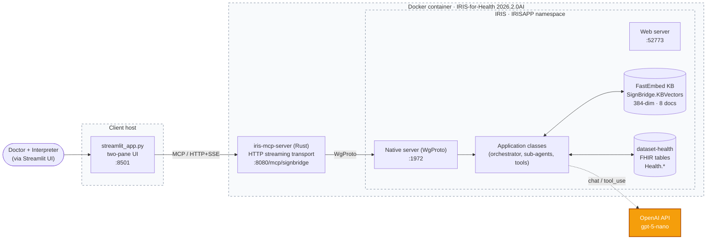
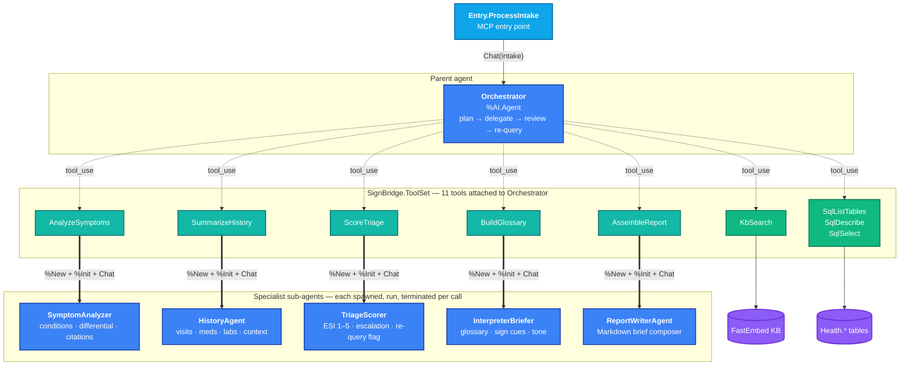
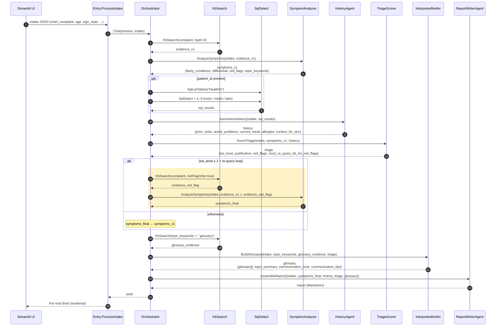
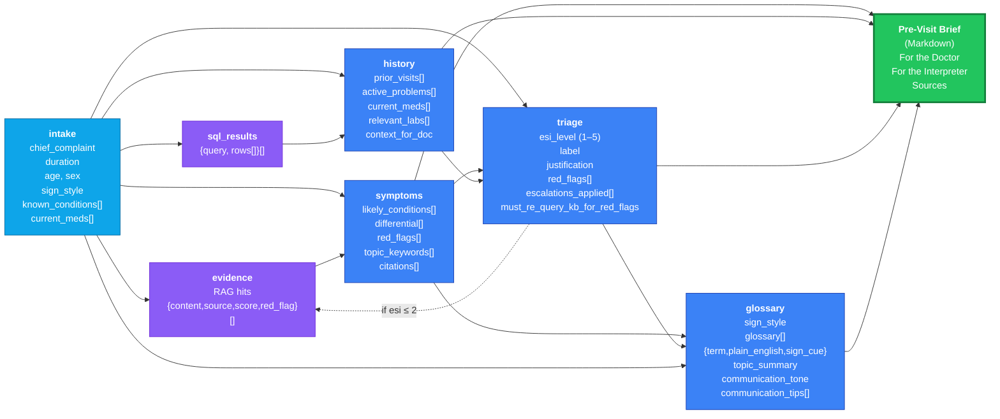
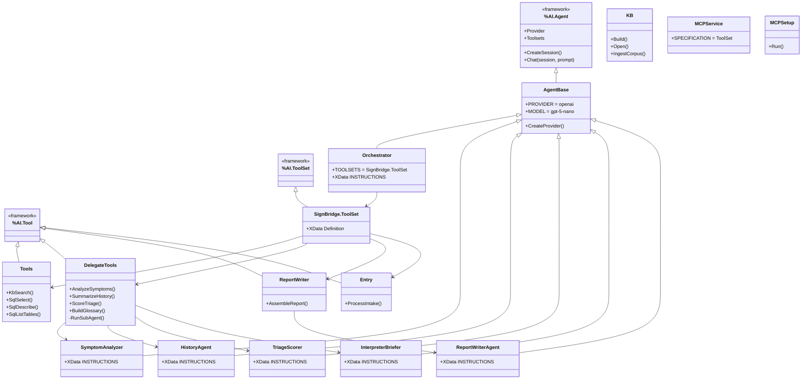

# SignBridge — Architecture

Pre-visit clinical triage for deaf patients on InterSystems IRIS-for-Health AI Hub. Five views, top-down: **system stack**, **agent topology**, **end-to-end sequence**, **data flow**, **class hierarchy**.

---

## 1. System architecture

End-to-end deployment view. The orchestration is server-side; the only thing the client (Streamlit) ever calls over MCP is `ProcessIntake`.



**What's notable:**
- One MCP tool exposed to the client (`ProcessIntake`); everything else stays inside IRIS.
- RAG corpus is local (FastEmbed, no API key). Patient data is local (`dataset-health`).
- Only the LLM is external — and we only need one provider key.

---

## 2. Agent topology

The "wow" view. One parent agent plans the call sequence; five specialist sub-agents do focused work. The orchestrator **reviews** sub-agent outputs and triggers a re-query loop when the triage scorer flags red-flag urgency — that's what makes this *agentic*, not a chained pipeline.



**Color key:** entry tool · parent + sub-agents · raw tools · delegate-task tools · data stores.

The orchestrator never talks to a sub-agent directly. It calls a **delegate tool** (e.g. `AnalyzeSymptoms`) which spawns the sub-agent, runs it, and returns its JSON output. This keeps every sub-agent invocation fully traceable in the activity log.

---

## 3. End-to-end sequence — the agentic flow

Nine-step plan with one re-query loop. The loop on the diagram is the centerpiece: when `TriageScorer` returns ESI ≤ 2 with `must_re_query_kb_for_red_flags = true`, the orchestrator goes back to the knowledge base for red-flag-only evidence and re-runs the symptom analyzer before assembling the brief.



The yellow band is the agentic step. It does not fire for routine cases (ESI 3–5) — only when the triage scorer escalates. That conditional is in the orchestrator's instructions, not hard-coded in ObjectScript.

---

## 4. Data flow — what travels between agents

Each arrow shows the **shape** of the JSON passed between agents. Sub-agents always emit strict JSON (no prose) — only the report writer emits Markdown.



**Read it as:** the intake fans out to four parallel-ish sub-agents (symptoms, history, triage, glossary) whose outputs all converge on the report writer. The dotted feedback arrow from `triage` back to `evidence` is the agentic re-query loop.

---

## 5. Class hierarchy — the IRIS implementation

Every agent shares one base class; every tool extends one framework class; one toolset wires it all up. The whole system is 15 classes.



**Why the design holds up:**
- **One base for all six agents** (`AgentBase`) — provider/model/key are configured once.
- **Sub-agents stay tool-free** — they receive evidence as JSON; the orchestrator owns retrieval. This makes their outputs reproducible and easy to unit-test.
- **One toolset** (`SignBridge.ToolSet`) is the entire MCP surface. Adding a new specialist is: write one `XData INSTRUCTIONS`, add one delegate tool method, ship.

---

## 6. Repository layout

```
ready-2026-team-07/
├── src/SignBridge/
│   ├── AgentBase.cls              ← shared %AI.Agent base
│   ├── Orchestrator.cls           ← parent agent + 9-step plan
│   ├── SubAgents/
│   │   ├── SymptomAnalyzer.cls
│   │   ├── HistoryAgent.cls
│   │   ├── TriageScorer.cls
│   │   ├── InterpreterBriefer.cls
│   │   └── ReportWriterAgent.cls
│   ├── Tools.cls                  ← KbSearch + SQL tools
│   ├── DelegateTools.cls          ← 4 sub-agent delegates
│   ├── ReportWriter.cls           ← AssembleReport tool
│   ├── Entry.cls                  ← ProcessIntake (MCP entry)
│   ├── ToolSet.cls                ← single MCP surface
│   ├── KB.cls                     ← FastEmbed builder
│   ├── MCPService.cls
│   ├── MCPSetup.cls
│   └── docs/                      ← 8-doc RAG corpus (.md)
├── app/
│   ├── streamlit_app.py           ← demo UI
│   └── test_signbridge.py         ← MCP smoke test
├── module.xml                     ← ZPM module spec
├── iris.script                    ← container init
├── config.toml                    ← iris-mcp-server config
└── docker-compose.yml
```
